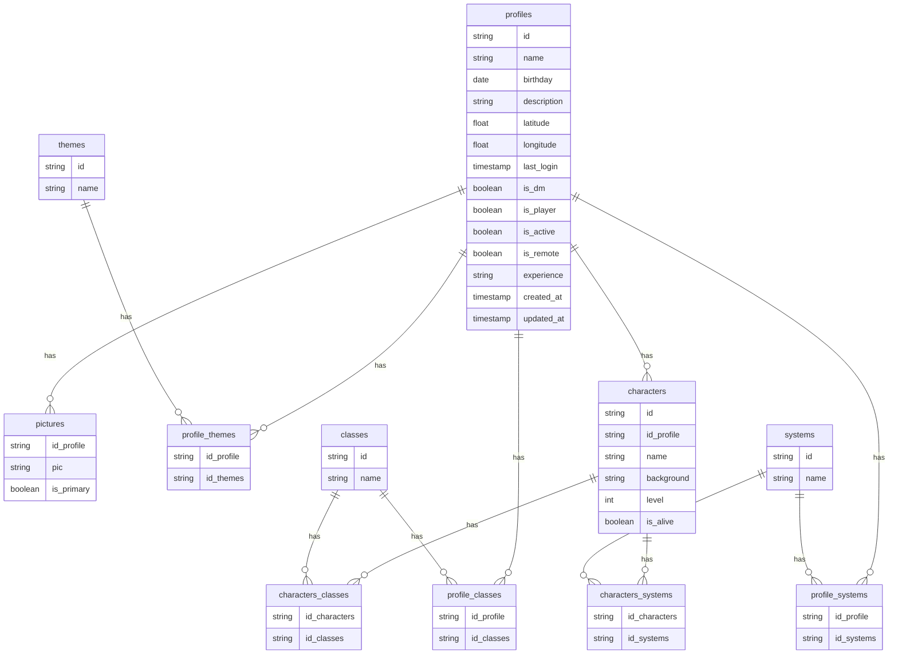

# profile-service — Diagrama ER

## Tabelas

| Tabela | PK | FKs reais (banco) | Refs externas |
|---|---|---|---|
| `profiles` | `id` UUID | — | `id` → User (auth-service via header `X-User-Id`) |
| `pictures` | (`id_profile`, `pic`) composta | `id_profile → profiles(id)` CASCADE | — |
| `themes` | `id` UUID | — | — |
| `profile_themes` | (`id_profile`, `id_themes`) composta | `id_profile → profiles(id)` CASCADE, `id_themes → themes(id)` CASCADE | — |
| `classes` | `id` UUID | — | — |
| `profile_classes` | (`id_profile`, `id_classes`) composta | `id_profile → profiles(id)` CASCADE, `id_classes → classes(id)` CASCADE | — |
| `systems` | `id` UUID | — | — |
| `profile_systems` | (`id_profile`, `id_systems`) composta | `id_profile → profiles(id)` CASCADE, `id_systems → systems(id)` CASCADE | — |
| `characters` | `id` UUID | `id_profile → profiles(id)` CASCADE | — |
| `characters_classes` | (`id_characters`, `id_classes`) composta | `id_characters → characters(id)` CASCADE, `id_classes → classes(id)` CASCADE | — |
| `characters_systems` | (`id_characters`, `id_systems`) composta | `id_characters → characters(id)` CASCADE, `id_systems → systems(id)` CASCADE | — |

## Enums

| Campo | Valores |
|---|---|
| `profiles.experience` | `beginner`, `intermediate`, `veteran` |

## Notas

- Todas as FKs usam `ON DELETE CASCADE` — deletar um perfil remove em cascata pictures, characters e todas as tabelas de junção associadas.
- `profiles.id` não é gerado pelo serviço: vem do header `X-User-Id` injetado pelo API Gateway após validação do JWT no auth-service.
- `pictures` tem PK composta (`id_profile`, `pic`); `id_profile` é simultaneamente FK e parte da PK.
- Todas as tabelas de junção têm PKs compostas; ambas as colunas são FK no banco.
- `pictures` existe na migração 002 mas não está mapeada na interface `Database` do Kysely (`src/adapters/outbound/db/types.ts`) — ainda sem repositório implementado.
- `characters_systems` modela N:N no banco, mas o domínio força 1:1 (um personagem pertence a exatamente um sistema RPG).
- Eventos publicados na exchange RabbitMQ `profile.events` (topic, durable); routing key configurável via `PROFILE_EVENT_ROUTING_KEY` (default: `profile.profile.updated`).
- Endpoint de resync (`POST /profiles/resync`) disponível apenas fora de produção (`NODE_ENV !== 'production'`).
